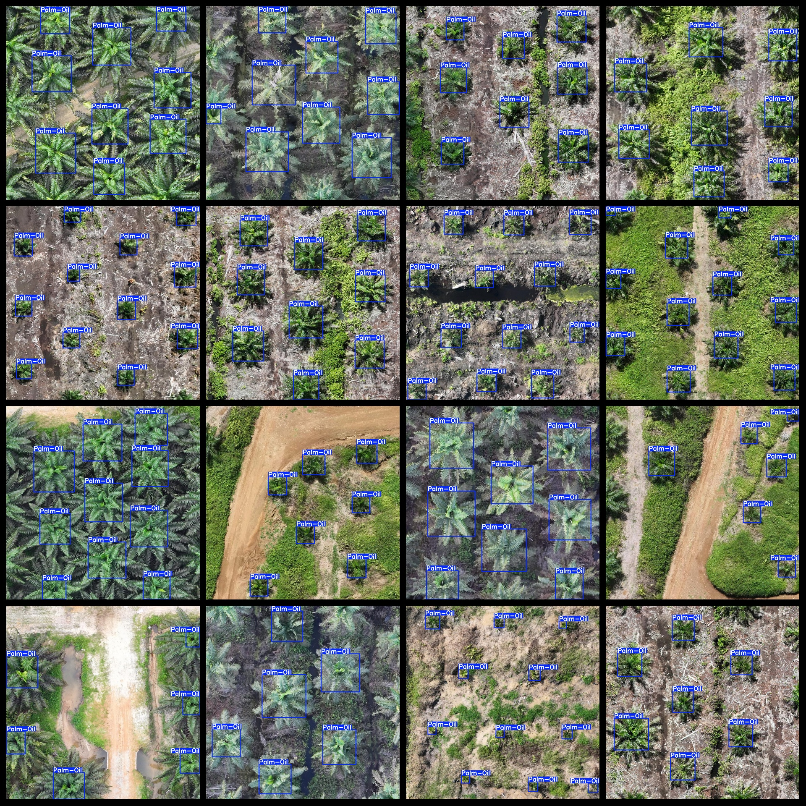

# Trachycarpus Wagnerianus Oil Dataset 853 imagesVOC+YOLO format

853 palm oil datasets in VOC + YOLO format

Dataset format: Pascal VOC format + YOLO format (the txt file does not contain the split path, it only contains jpg images and corresponding VOC format xml files and yolo format txt files)

Number of images (total jpg files): 853

Number of xml files: 853

Number of annotations (number of txt files): 853

Number of categories: 1

The Github repository is: datasets_sl

Category Name: ["Palm-Oil"]

Number of boxes labeled in each category:

Palm-Oil Frame Count = 7102

Total Frames: 7102

Number of images per category:

Palm-Oil occupies 853 pictures.

Image resolution: 1280x1280

Use the labeling tool: labelImg

Dataset Augmentation: No

Rules for annotation: Draw a rectangle around the category.

Important note: The dataset does not have been divided into training, validation, and testing sets.

Special Disclaimer: This dataset does not guarantee the accuracy of the trained models or weight files.

Annotation and image details are as follows:

## Images

---

Here is a pay link on Stripe (https://buy.stripe.com/3cs8yP7sY87d0vu9AB). Please contact me lonlonago@foxmail.com after funding $89, and I will send you a complete data files, thank you!

